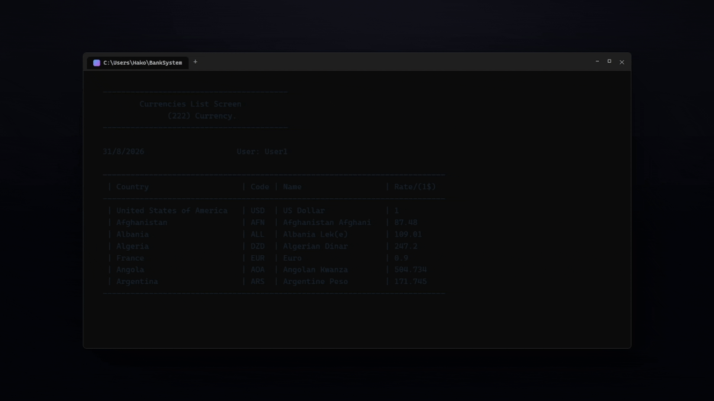

<div align="center">

# Bank Management System

A console-based banking application built in C++ that handles the core operations of a real bank: deposits, withdrawals, card withdrawals, transfers, and currency exchange — with all data persisted to encrypted local files.



</div>

## Overview

Bank Management System is a C++ console application that simulates the day-to-day operations of a bank back office. It covers account transactions, a full user management system with permission levels, a transfer log for auditing, and a built-in currency exchange module covering 222 world currencies.

The project focuses on core logic and data integrity rather than a graphical interface — every operation is validated, logged, and persisted, with sensitive data protected through encryption.

## Features

- **Core banking transactions** — deposit, withdraw, card withdrawal, and transfer between accounts
- **Balances overview** — full client list with account numbers and running total balance
- **Transfer log** — every transfer recorded with date/time, source/destination accounts, amount, and resulting balances for auditing
- **Currency exchange module** — list, search, and update exchange rates across 222 currencies, plus a built-in currency calculator
- **User management** — add, update, delete, find, and list system users
- **Role-based permissions** — each user account carries its own permission level controlling which operations it can access
- **Encrypted local storage** — no database dependency; all records (users, clients, transfers) are stored in flat files, one record per line, with passwords protected via encryption

## Tech Stack

| Component | Technology |
|---|---|
| Language | C++ |
| IDE / Build | Visual Studio |
| Data Storage | Flat files (encrypted) |
| Interface | Console (Windows Terminal) |

## Screens

The demo above shows the application launching, signing in, browsing the transactions menu and client balances, and using the currency exchange module.

## Getting Started

1. Open the project solution in Visual Studio
2. Build and run the console application
3. Sign in with a full-access account to explore every module:

   ```
   Username: User1
   Password: aaaa
   ```

## Author

**Meriouma Abdelhak**
Windows desktop application developer — C# · C++ · SQL Server

## License

This project is available under the MIT License.
